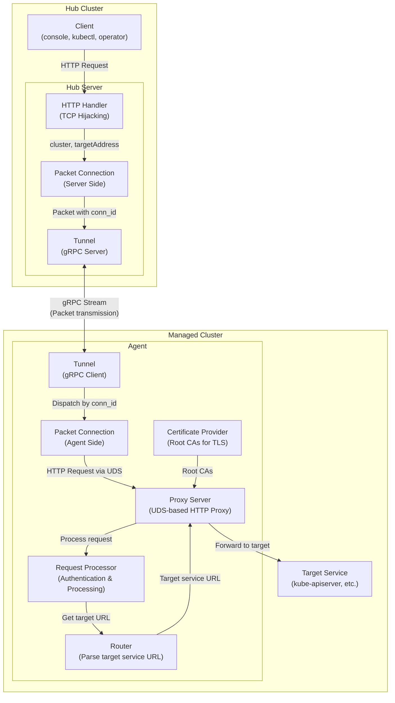

# Multi-Cluster Tunnel

## Background & Goals

In multi-cluster environments, modern enterprises often operate many Kubernetes clusters across clouds, regions, or data centers. A central **Hub** must efficiently manage these **Managed Clusters** to enable:

- **Control Plane Access**: Secure, unified access from the Hub to each cluster's `kube-apiserver` and internal services.
- **Component Reporting**: Reliable reporting of status, logs, and events from clusters back to the Hub.

**mctunnel** creates a persistent, bi-directional gRPC tunnel between each Managed Cluster and the Hub.

Key goals:

- **Protocol Agnostic**: Support HTTP, gRPC, and custom protocols via pluggable adapters.
- **Single Connection Multiplexing**: All traffic over one outbound connection per cluster.
- **Dynamic, Secure, and Scalable**: On-demand routing with minimal privileges and no Ingress exposure.
- **TLS Security**: Built-in TLS encryption for secure cross-cluster communication.
- **Extensible**: Custom routing, adapters, authentication, and observability.

## Architecture Overview

- **1 Tunnel / 1 Cluster**: Each Managed Cluster initiates and maintains a persistent gRPC connection via the **Agent** at startup, reducing firewall and NAT traversal complexity.
- **Packet-based Multiplexing**: Multiple client connections are multiplexed over a single tunnel using `conn_id` for packet routing.
- **UDS-based Proxy**: The agent now uses a Unix Domain Socket (UDS) based proxy server instead of directly connecting to services, providing better isolation and request processing capabilities.

## Architecture Constraints

**mctunnel** is designed with the following architectural constraints for simplicity and reliability:

- **Single Hub Instance**: Only one Hub server instance should be running per Hub cluster. The Hub is stateful and maintains active connections from all managed clusters.
- **Single Agent Instance**: Only one Agent instance should be running per managed cluster. Each cluster establishes exactly one persistent gRPC connection to the Hub.
- **1:1 Cluster-Connection Mapping**: Each managed cluster has exactly one active connection to the Hub. If a new agent from the same cluster connects, it will replace the existing connection.

These constraints ensure:
- **Simplified Connection Management**: No need for complex load balancing or connection pooling
- **Predictable Routing**: Each cluster has a single, well-defined path to the Hub
- **Easier Troubleshooting**: Clear 1:1 mapping between clusters and connections
- **Reduced Resource Usage**: Minimal connection overhead and memory footprint

## Key Architectural Changes

The agent architecture has been significantly redesigned to improve modularity and security:

### Hub Side Changes
- **Removed Router Component**: The hub no longer contains routing logic. It focuses purely on packet forwarding and connection management.

### Agent Side Changes
- **UDS-based Proxy Server**: Replaced direct service connections with a Unix Domain Socket-based HTTP proxy server (`/tmp/multiclustertunnel.sock`)
- **Request Processor**: Added dedicated component for handling authentication, authorization, and request transformations
- **Agent-side Router**: Moved routing logic from hub to agent, allowing for more flexible and secure request parsing
- **Certificate Provider**: Added component to manage root CAs for secure TLS connections to target services

### Benefits of New Architecture
- **Better Security**: Request processing and authentication happen within the managed cluster
- **Improved Modularity**: Clear separation of concerns with dedicated components
- **Enhanced Flexibility**: Agent-side routing allows for cluster-specific routing logic
- **Simplified Hub**: Hub focuses on connection management and packet forwarding

## Key Features

| Feature                            | Description                                                                       |
| ---------------------------------- | --------------------------------------------------------------------------------- |
| **Packet-based Protocol**          | Uses structured Packet messages with conn_id for multiplexing and control codes  |
| **Single Connection Multiplexing** | All logical connections are multiplexed over a single gRPC stream using conn_id  |
| **UDS-based Proxy Architecture**   | Agent uses Unix Domain Socket-based proxy for better isolation and processing    |
| **Modular Request Processing**      | Dedicated components for authentication, routing, and certificate management     |
| **TCP Connection Hijacking**       | Direct TCP stream access for transparent data forwarding                         |
| **Sequential Packet Processing**   | Packets with same conn_id are processed sequentially to maintain order           |
| **Agent-side Routing**             | Flexible routing logic within managed clusters for better security               |
| **Minimal Privileges**             | Only requires outbound dialing from managed clusters, no Ingress exposure        |

## Packet Structure & Connection Management

### Packet Protocol
Each packet transmitted through the tunnel contains the following fields:

- **`conn_id` (int64)**: Unique identifier for multiplexing multiple logical connections. For tunnel-level control messages (such as DRAIN), this can be 0.
- **`code` (ControlCode)**: The intent code of the packet that defines how it should be processed:
  - `DATA (0)`: Default value, indicates this is a standard business data packet
  - `ERROR (1)`: Indicates an error occurred in processing the connection for a conn_id
  - `DRAIN (2)`: Graceful shutdown signal sent by agent to hub when going offline
- **`data` (bytes)**: Business payload, only meaningful when code = DATA
- **`error_message` (string)**: Error details, only meaningful when code = ERROR

### Key Protocol Changes
- **Removed `target_address` field**: Target address routing is now handled by the UDS-based proxy server on the agent side, simplifying the packet structure
- **Implicit Connection Lifecycle**: Connection establishment and teardown are handled implicitly through the packet flow
- **Simplified Routing**: The hub no longer needs to parse target addresses; it simply forwards packets based on `conn_id`

### Connection Lifecycle
1. **Establishment**: Connections are established implicitly when the first DATA packet for a new `conn_id` is received
2. **Data Transfer**: All business data is transmitted using DATA packets with the appropriate `conn_id`
3. **Error Handling**: ERROR packets are sent when processing fails, containing error details in `error_message`
4. **Graceful Shutdown**: DRAIN packets (with `conn_id = 0`) signal graceful agent shutdown
5. **Sequential Processing**: Packets with the same `conn_id` are processed sequentially to maintain order
6. **Multiplexing**: Different `conn_id` values can be processed asynchronously for better performance

## Request Lifecycle

1. **Client → HTTP Handler**
   Client sends HTTP requests to the hub server. The HTTP handler receives the request and hijacks the TCP connection for direct data forwarding.

2. **Hub-side Routing**
   The hub server extracts the target cluster name from the request and creates a packet connection to route the request through the appropriate tunnel.

3. **Packet Connection Creation**
   The hub server creates a new packet connection for this client request and establishes a logical connection through the tunnel to the target cluster.

4. **Connection Establishment**
   - An initial empty packet with `TargetAddress` is sent to establish the connection on the agent side
   - The original HTTP request is then sent as a data packet (also with `TargetAddress` during establishment phase)
   - The agent receives these packets and forwards them to the UDS-based proxy server

5. **Agent-side Processing**
   - **Proxy Server**: Receives the HTTP request via Unix Domain Socket and acts as a reverse proxy
   - **Request Processor**: Processes the request for authentication, authorization, and other transformations
   - **Router**: Parses the request to determine the actual target service URL within the managed cluster
   - **Certificate Provider**: Provides root CAs for secure TLS connections to target services

6. **Service Forwarding**
   The proxy server forwards the processed request to the target service (kube-apiserver or other services) using HTTPS with proper TLS configuration.

7. **Response Path**
   The response travels back through the same path: Target Service → Proxy Server → UDS → Agent → Tunnel → Hub Server → Client TCP connection.

## Core Abstractions

### Packet
The atomic unit of data transmission between hub cluster and managed cluster through gRPC stream. Packets carry both data information and control information.

Key fields:
- **`conn_id` (int64)**: Used to associate requests and responses, implements multiplexing ID. Can be 0 for tunnel-level control messages
- **`code` (ControlCode)**: Control code that defines the packet's intent:
  - `DATA (0)`: Standard business data packet
  - `ERROR (1)`: Error occurred in processing the connection
  - `DRAIN (2)`: Graceful shutdown signal from agent to hub
- **`data` (bytes)**: Business payload, only meaningful when code = DATA
- **`error_message` (string)**: Error details, only meaningful when code = ERROR

The agent receives packets and forwards HTTP requests to the UDS-based proxy server, which handles target service routing internally.

### Tunnel
The persistent gRPC connection between a managed cluster's agent and the Hub. Each cluster has exactly one active Tunnel (per cluster). When an agent connects, it creates a Tunnel that remains active until the agent disconnects or a new agent from the same cluster replaces it.

### Packet Connection (Server Side)
Each packet connection corresponds to an actual client (console, kubectl, or operator). When the server receives an HTTP request from a client:
1. The hub server determines the target managed cluster based on the request path
2. The packet connection hijacks the underlying TCP connection from HTTP using a hijacker, allowing direct read/write access to the TCP data stream
3. Data is then forwarded through the tunnel to the agent with the appropriate `conn_id` for multiplexing

### Packet Connection (Agent Side)
Each packet connection corresponds to an HTTP request forwarded to the UDS-based proxy server. The agent:
1. Receives packets from the hub through the tunnel
2. Forwards HTTP requests to the proxy server via Unix Domain Socket
3. Handles bidirectional data forwarding between the tunnel and the proxy server

### Proxy Server
A UDS-based HTTP reverse proxy server that runs within the agent. It:
1. Listens on a Unix Domain Socket for incoming HTTP requests from packet connections
2. Uses the Request Processor to handle authentication and request transformations
3. Uses the Router to determine target service URLs
4. Uses the Certificate Provider to establish secure TLS connections
5. Forwards requests to target services and returns responses

### Request Processor
Handles HTTP request processing before forwarding to target services. It:
1. Performs authentication validation for both hub and managed cluster users
2. Implements user impersonation for hub users accessing managed cluster resources
3. Processes authorization headers and tokens
4. Returns appropriate HTTP status codes for authentication failures

### Router (Agent Side)
Parses HTTP requests to determine target service URLs within the managed cluster. It:
1. Analyzes request URIs to identify the target service type (kube-apiserver vs. service)
2. Extracts namespace, service name, and port information for service requests
3. Constructs proper target URLs for HTTPS connections
4. Supports both kube-apiserver and service proxy patterns

### Certificate Provider
Provides root certificate authorities for secure TLS connections. It:
1. Loads the Kubernetes service account CA certificate
2. Provides root CAs for validating target service certificates
3. Ensures secure HTTPS connections to kube-apiserver and other services

## Contribution Guide

1. Fork → create a new branch → submit PR
2. Each PR should include unit tests
3. Code review will be automatically triggered after CI passes

## License

Distributed under the **Apache-2.0** license.
See [`LICENSE`](./LICENSE) for more information.
