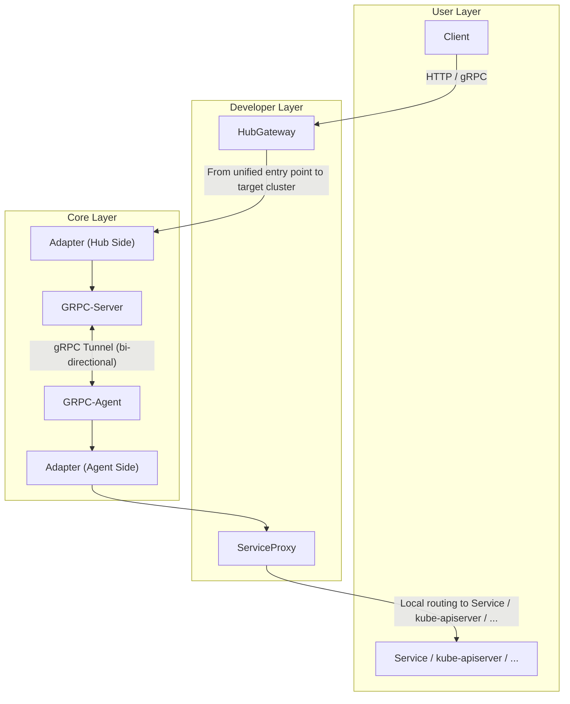

# Multi-Cluster Tunnel

## Background & Goals

In multi-cluster environments, modern enterprises often operate many Kubernetes clusters across clouds, regions, or data centers. A central **Hub** must efficiently manage these **Managed Clusters** to enable:

- **Control Plane Access**: Secure, unified access from the Hub to each cluster's `kube-apiserver` and internal services.
- **Component Reporting**: Reliable reporting of status, logs, and events from clusters back to the Hub.

**mctunnel** creates a persistent, bi-directional gRPC tunnel between each Managed Cluster and the Hub. The **HubGateway** serves as a unified entry point, forwarding requests to any cluster. On the cluster side, a local **ServiceProxy** receives tunneled requests and routes them to in-cluster services.

Key goals:

- **Protocol Agnostic**: Support HTTP, gRPC, and custom protocols via pluggable adapters.
- **Single Connection Multiplexing**: All traffic over one outbound connection per cluster.
- **Dynamic, Secure, and Scalable**: On-demand routing with minimal privileges and no Ingress exposure.
- **Extensible**: Custom routing, adapters, authentication, and observability.

---

## Architecture Overview



- **1 Tunnel / 1 Cluster**: Each Managed Cluster initiates and maintains a persistent connection via **GRPC-Agent** at startup, reducing firewall and NAT traversal complexity.
- **Adapter Layer**: "Routing metadata" is uniformly carried in headers, e.g., `x-mctunnel-proto`, `x-mctunnel-port`, `x-mctunnel-cluster`. Any protocol that can be converted to the Adapter format can be transmitted through the tunnel.
- **Pluggable Gateway and Proxy**: HTTP, gRPC, GraphQL, etc., can be adapted via custom HubGateway and ServiceProxy implementations, achieving **protocol-agnostic business integration**.

---

## Key Features

| Feature                            | Description                                                                       |
| ---------------------------------- | --------------------------------------------------------------------------------- |
| **Multi-Protocol**                 | Built-in support for HTTP (REST/Proxy) and gRPC; extendable via Adapter           |
| **Single Connection Multiplexing** | All logical streams are multiplexed over a single gRPC stream, saving connections |
| **Dynamic Routing**                | On-demand forwarding based on `managed_cluster_name` + header metadata            |
| **Bi-directional Communication**   | Supports both Hub → Cluster requests and Agent → Hub reporting                    |
| **Minimal Privileges**             | Only requires outbound dialing from sub-clusters, no Ingress exposure             |

---

## Quick Start

> **Prerequisites**: Go 1.22+, Docker / Podman, Kubernetes 1.25+

```bash
# 1. Start Hub-side components
make run-hub          # Defaults to 0.0.0.0:8080 (HubGateway) & 8443 (GRPC-Server)

# 2. Start Agent on Managed Cluster
# Assume KUBECONFIG is configured
make run-agent \
  HUB_ADDR="hub.example.com:8443" \
  CLUSTER_NAME="cluster-a"

# 3. Test request
curl -k "https://hub.example.com:8080/cluster-a/api/v1/namespaces/default/services/https:helloworld:8080/proxy-service/ping?time-out=32s"
```

> _For more local development and Helm Chart deployment examples, see [`docs/tutorials`](./docs/tutorials)._

---

## Request Lifecycle

1. **Client → HubGateway**
   _HTTP_: Follows Kubernetes API format
   _gRPC_: Custom proto, headers carry target cluster and service info
2. **HubGateway → Hub-Side Adapter**
   Converts URL/Method/Body to Adapter message, attaches `x-mctunnel-cluster`, `x-mctunnel-proto`, `x-mctunnel-port`, etc.
3. **Hub-Side Adapter → GRPC-Server**
   Writes into the tunnel via stream.
4. **GRPC-Server ↔ GRPC-Agent**
   The corresponding tunnel is continuously consumed by the target Agent.
5. **GRPC-Agent → Agent-Side Adapter → ServiceProxy**
   ServiceProxy locally finds or load-balances to the actual service.
6. **Response Path**
   The result returns along the original tunnel path, and HubGateway decodes and writes it back to the Client.

---

## Contribution Guide

1. Fork → create a new branch → submit PR
2. Each PR should include unit tests
3. Code review will be automatically triggered after CI passes

---

## License

Distributed under the **Apache-2.0** license.
See [`LICENSE`](./LICENSE) for more information.
