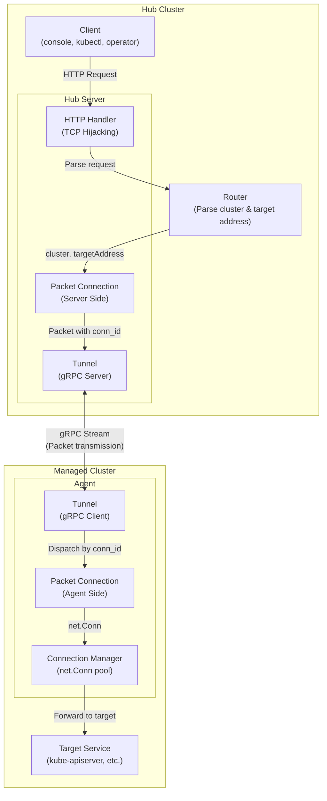

# Multi-Cluster Tunnel

## Background & Goals

In multi-cluster environments, modern enterprises often operate many Kubernetes clusters across clouds, regions, or data centers. A central **Hub** must efficiently manage these **Managed Clusters** to enable:

- **Control Plane Access**: Secure, unified access from the Hub to each cluster's `kube-apiserver` and internal services.
- **Component Reporting**: Reliable reporting of status, logs, and events from clusters back to the Hub.

**mctunnel** creates a persistent, bi-directional gRPC tunnel between each Managed Cluster and the Hub.

Key goals:

- **Protocol Agnostic**: Support HTTP, gRPC, and custom protocols via pluggable adapters.
- **Single Connection Multiplexing**: All traffic over one outbound connection per cluster.
- **Dynamic, Secure, and Scalable**: On-demand routing with minimal privileges and no Ingress exposure.
- **TLS Security**: Built-in TLS encryption for secure cross-cluster communication.
- **Extensible**: Custom routing, adapters, authentication, and observability.

## Architecture Overview


```mermaid
flowchart TD
  subgraph Hub Cluster
    Client["Client<br/>(console, kubectl, operator)"]
    Router["Router<br/>(Parse cluster & target address)"]
    subgraph Hub Server
      HTTPHandler["HTTP Handler<br/>(TCP Hijacking)"]
      PacketConnServer["Packet Connection<br/>(Server Side)"]
      TunnelServer["Tunnel<br/>(gRPC Server)"]
    end
  end

  subgraph Managed Cluster
    subgraph Agent
      TunnelClient["Tunnel<br/>(gRPC Client)"]
      PacketConnAgent["Packet Connection<br/>(Agent Side)"]
      ConnManager["Connection Manager<br/>(net.Conn pool)"]
    end
    Service["Target Service<br/>(kube-apiserver, etc.)"]
  end

  Client -->|"HTTP Request"| HTTPHandler
  HTTPHandler -->|"Parse request"| Router
  Router -->|"cluster, targetAddress"| PacketConnServer
  PacketConnServer -->|"Packet with conn_id"| TunnelServer
  TunnelServer <-->|"gRPC Stream<br/>(Packet transmission)"| TunnelClient
  TunnelClient -->|"Dispatch by conn_id"| PacketConnAgent
  PacketConnAgent -->|"net.Conn"| ConnManager
  ConnManager -->|"Forward to target"| Service
```

- **1 Tunnel / 1 Cluster**: Each Managed Cluster initiates and maintains a persistent gRPC connection via the **Agent** at startup, reducing firewall and NAT traversal complexity.
- **Packet-based Multiplexing**: Multiple client connections are multiplexed over a single tunnel using `conn_id` for packet routing.

## Architecture Constraints

**mctunnel** is designed with the following architectural constraints for simplicity and reliability:

- **Single Hub Instance**: Only one Hub server instance should be running per Hub cluster. The Hub is stateful and maintains active connections from all managed clusters.
- **Single Agent Instance**: Only one Agent instance should be running per managed cluster. Each cluster establishes exactly one persistent gRPC connection to the Hub.
- **1:1 Cluster-Connection Mapping**: Each managed cluster has exactly one active connection to the Hub. If a new agent from the same cluster connects, it will replace the existing connection.

These constraints ensure:
- **Simplified Connection Management**: No need for complex load balancing or connection pooling
- **Predictable Routing**: Each cluster has a single, well-defined path to the Hub
- **Easier Troubleshooting**: Clear 1:1 mapping between clusters and connections
- **Reduced Resource Usage**: Minimal connection overhead and memory footprint


## Key Features

| Feature                            | Description                                                                       |
| ---------------------------------- | --------------------------------------------------------------------------------- |
| **Packet-based Protocol**          | Uses structured Packet messages with conn_id for multiplexing and control codes  |
| **Single Connection Multiplexing** | All logical connections are multiplexed over a single gRPC stream using conn_id  |
| **Dynamic Routing**                | Router interface allows custom parsing logic for cluster and service routing     |
| **TCP Connection Hijacking**       | Direct TCP stream access for transparent data forwarding                         |
| **Sequential Packet Processing**   | Packets with same conn_id are processed sequentially to maintain order           |
| **Minimal Privileges**             | Only requires outbound dialing from managed clusters, no Ingress exposure        |

## Packet Structure & Connection Management

### Packet Protocol
Each packet transmitted through the tunnel contains:
- `conn_id`: Unique identifier for multiplexing multiple logical connections
- `code`: Control code (DATA, ERROR, DRAIN) defining packet intent
- `data`: Business payload for DATA packets
- `target_address`: Target service address (used during connection establishment)

### Connection Lifecycle
1. **Establishment**: Initial packets include `target_address` to tell agent which service to connect to
2. **Data Transfer**: Subsequent packets omit `target_address` for performance optimization
3. **Sequential Processing**: Packets with same `conn_id` are processed sequentially to maintain order
4. **Multiplexing**: Different `conn_id` values can be processed asynchronously for better performance

## Request Lifecycle

1. **Client → HTTP Handler**
   Client sends HTTP requests to the hub server. The HTTP handler receives the request and uses the Router to parse routing information from the request path, parameters, or headers.

2. **Router Parsing**
   Router implements custom parsing logic to extract:
   - `cluster`: The name of the managed cluster to route the request to
   - `targetAddress`: The target service address within the managed cluster (set in packet.TargetAddress)

3. **Packet Connection Creation**
   The hub server creates a new packet connection for this client request and establishes a logical connection through the tunnel to the target cluster.

4. **Connection Establishment**
   - An initial empty packet with `TargetAddress` is sent to establish the connection on the agent side
   - The original HTTP request is then sent as a data packet (also with `TargetAddress` during establishment phase)
   - The agent receives these packets and creates a `net.Conn` to the specified target service

5. **TCP Hijacking & Data Forwarding**
   - The HTTP connection is hijacked to access the underlying TCP stream
   - Bidirectional data forwarding begins between the client TCP connection and the packet connection
   - Subsequent data packets omit `TargetAddress` for performance optimization

6. **Response Path**
   The response travels back through the same path: Target Service → Agent (net.Conn) → Tunnel → Hub Server → Client TCP connection.

## Router Interface

The Router is a key abstraction that allows developers to implement custom routing logic. It defines how HTTP requests are parsed to determine the target cluster and service:

```go
type Router interface {
    // Parse extracts the target cluster name and target address from the HTTP request
    // cluster: the name of the managed cluster to route the request to
    // targetAddress: the target service address within the managed cluster (will be set in packet.TargetAddress)
    Parse(r *http.Request) (cluster, targetAddress string, err error)
}
```

### Example Router Implementation

```go
type SimpleRouter struct{}

func (r *SimpleRouter) Parse(req *http.Request) (cluster, targetAddress string, err error) {
    // Extract cluster name from path: /cluster-name/service-path
    path := req.URL.Path[1:] // Remove leading /
    if len(path) == 0 {
        return "", "", fmt.Errorf("missing cluster name")
    }

    // Find first slash to separate cluster name from service path
    parts := strings.SplitN(path, "/", 2)
    cluster = parts[0]

    // Route to target service (could be dynamic based on path/headers)
    targetAddress = "localhost:8080"

    return cluster, targetAddress, nil
}
```

The Router enables flexible routing strategies based on:
- URL path segments
- HTTP headers
- Query parameters
- Request method
- Custom business logic

## Core Abstractions

### Packet
The atomic unit of data transmission between hub cluster and managed cluster through gRPC stream. Packets carry both data information and control information.

Key fields:
- `conn_id`: Used to associate requests and responses, implements multiplexing ID
- `code`: Control code (DATA, ERROR, DRAIN) that defines the packet's intent
- `data`: Business payload, only meaningful when code = DATA
- `target_address`: Target service address for routing (used during connection establishment)

The agent dispatches packet data to target services on the managed cluster based on the `target_address` field.

### Tunnel
The persistent gRPC connection between a managed cluster's agent and the Hub. Each cluster has exactly one active Tunnel (per cluster). When an agent connects, it creates a Tunnel that remains active until the agent disconnects or a new agent from the same cluster replaces it.

### Packet Connection (Server Side)
Each packet connection corresponds to an actual client (console, kubectl, or operator). When the server receives an HTTP request from a client:
1. The Router determines the target managed cluster and service based on the request
2. The packet connection hijacks the underlying TCP connection from HTTP using a hijacker, allowing direct read/write access to the TCP data stream
3. Data is then forwarded through the tunnel to the agent

### Packet Connection (Agent Side)
Each packet connection corresponds to a `net.Conn` that connects to a target service on the managed cluster. The agent:
1. Receives packets from the hub through the tunnel
2. Establishes connections to target services based on the `target_address` field
3. Forwards data between the tunnel and the target service connection

## Contribution Guide

1. Fork → create a new branch → submit PR
2. Each PR should include unit tests
3. Code review will be automatically triggered after CI passes

## License

Distributed under the **Apache-2.0** license.
See [`LICENSE`](./LICENSE) for more information.
