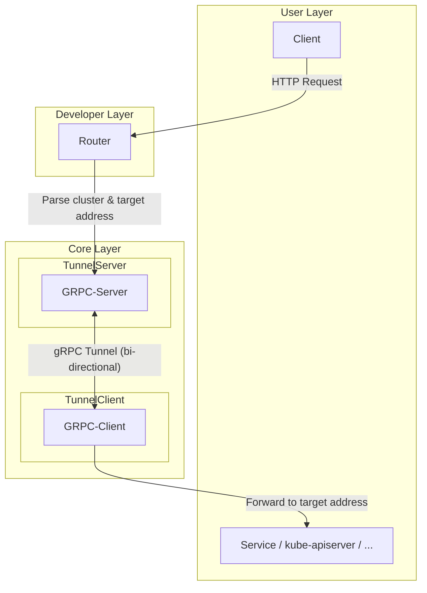

# Multi-Cluster Tunnel

## Background & Goals

In multi-cluster environments, modern enterprises often operate many Kubernetes clusters across clouds, regions, or data centers. A central **Hub** must efficiently manage these **Managed Clusters** to enable:

- **Control Plane Access**: Secure, unified access from the Hub to each cluster's `kube-apiserver` and internal services.
- **Component Reporting**: Reliable reporting of status, logs, and events from clusters back to the Hub.

**mctunnel** creates a persistent, bi-directional gRPC tunnel between each Managed Cluster and the Hub.

Key goals:

- **Protocol Agnostic**: Support HTTP, gRPC, and custom protocols via pluggable adapters.
- **Single Connection Multiplexing**: All traffic over one outbound connection per cluster.
- **Dynamic, Secure, and Scalable**: On-demand routing with minimal privileges and no Ingress exposure.
- **TLS Security**: Built-in TLS encryption for secure cross-cluster communication.
- **Extensible**: Custom routing, adapters, authentication, and observability.

## Architecture Overview


```mermaid
flowchart TD
  subgraph User Layer
    Client["Client"]
    Service["Service / kube-apiserver / ..."]
  end

  subgraph Developer Layer
    Router["Router"]
  end

  subgraph Core Layer
    subgraph TunnelServer
      GRPC-Server["GRPC-Server"]
    end
    subgraph TunnelClient
      GRPC-Client["GRPC-Client"]
    end
  end

  Client -->|"HTTP Request"| Router
  Router -->|"Parse cluster & target address"| GRPC-Server
  GRPC-Server <--> |"gRPC Tunnel (bi-directional)"| GRPC-Client
  GRPC-Client -->|"Forward to target address"| Service
```

- **1 Tunnel / 1 Cluster**: Each Managed Cluster initiates and maintains a persistent connection via **GRPC-Client** at startup, reducing firewall and NAT traversal complexity.

## Architecture Constraints

**mctunnel** is designed with the following architectural constraints for simplicity and reliability:

- **Single Hub Instance**: Only one Hub server instance should be running per Hub cluster. The Hub is stateful and maintains active connections from all managed clusters.
- **Single Agent Instance**: Only one Agent instance should be running per managed cluster. Each cluster establishes exactly one persistent gRPC connection to the Hub.
- **1:1 Cluster-Connection Mapping**: Each managed cluster has exactly one active connection to the Hub. If a new agent from the same cluster connects, it will replace the existing connection.

These constraints ensure:
- **Simplified Connection Management**: No need for complex load balancing or connection pooling
- **Predictable Routing**: Each cluster has a single, well-defined path to the Hub
- **Easier Troubleshooting**: Clear 1:1 mapping between clusters and connections
- **Reduced Resource Usage**: Minimal connection overhead and memory footprint


## Key Features

| Feature                            | Description                                                                       |
| ---------------------------------- | --------------------------------------------------------------------------------- |
| **Multi-Protocol**                 | Built-in support for HTTP (REST/Proxy) and gRPC; extendable via Adapter           |
| **Single Connection Multiplexing** | All logical streams are multiplexed over a single gRPC stream, saving connections |
| **Dynamic Routing**                | On-demand forwarding based on `managed_cluster_name` + header metadata            |
| **Bi-directional Communication**   | Supports both Hub → Cluster requests and Agent → Hub reporting                    |
| **Minimal Privileges**             | Only requires outbound dialing from sub-clusters, no Ingress exposure             |

---

## Quick Start

> **Prerequisites**: Go 1.22+, Docker / Podman, Kubernetes 1.25+

```bash
# 1. Start Hub-side components
make run-hub          # Defaults to 0.0.0.0:8080 (Router) & 8443 (GRPC-Server)

# 2. Start Agent on Managed Cluster
# Assume KUBECONFIG is configured
make run-agent \
  HUB_ADDR="hub.example.com:8443" \
  CLUSTER_NAME="cluster-a"

# 3. Test request
curl -k "https://hub.example.com:8080/cluster-a/api/v1/namespaces/default/services/https:helloworld:8080/proxy-service/ping?time-out=32s"
```

> _For more local development and Helm Chart deployment examples, see [`docs/tutorials`](./docs/tutorials)._

## Request Lifecycle

1. **Client → Router**
   Client sends HTTP requests to Router. Users can include routing information in the request path, parameters, or headers to help determine the target destination.

2. **Router → GRPC-Server**
   Router implements custom parsing logic based on the HTTP request's path, parameters, and headers to determine which managed cluster the request should be routed to and the target service address. It then forwards the HTTP request through the established gRPC tunnel to the corresponding grpc-client.

3. **GRPC-Server ↔ GRPC-Client**
   The HTTP request is transmitted through the persistent gRPC tunnel to the target managed cluster.

4. **GRPC-Client → Target Service**
   The grpc-client receives the request and forwards it directly to the target service address specified by the Router.

5. **Response Path**
   The response travels back through the same tunnel path: Target Service → GRPC-Client → GRPC-Server → Router → Client.

## Security

### TLS Encryption

The multiclustertunnel supports TLS encryption for secure communication between agents and the hub server. This is essential for production deployments where agents and the hub are deployed across different networks.

**Hub Server TLS Configuration:**
```go
config := &hub.Config{
    GRPCListenAddress: ":8443",
    HTTPListenAddress: ":8080",
    Router:            router,
    TLSConfig: &tls.Config{
        Certificates: []tls.Certificate{cert},
    },
}
```

**Agent TLS Configuration:**
```go
config := &agent.Config{
    HubAddress:  "hub.example.com:8443",
    ClusterName: "cluster-a",
    DialOptions: []grpc.DialOption{
        grpc.WithTransportCredentials(credentials.NewTLS(tlsConfig)),
    },
}
```

### Usage Examples

**Hub Server with TLS:**
```bash
# With TLS certificates
./test-hub-server -cert-file=server.crt -key-file=server.key

# Without TLS (development only)
./test-hub-server
```

**Agent Client with TLS:**
```bash
# With TLS (default)
./test-agent-client -hub-address=hub.example.com:8443 -cluster-name=my-cluster

# With TLS but skip verification (testing)
./test-agent-client -hub-address=localhost:8443 -cluster-name=my-cluster -skip-tls-verify

# Without TLS (development only)
./test-agent-client -hub-address=localhost:8443 -cluster-name=my-cluster -insecure
```

For detailed TLS configuration examples, see the test tools:
- [`cmd/test-hub-server/`](./cmd/test-hub-server/) - Hub server with TLS support
- [`cmd/test-agent-client/`](./cmd/test-agent-client/) - Agent client with TLS options

## Terminology

**Tunnel**: The persistent gRPC connection between a managed cluster's agent and the Hub. Each cluster has exactly one active Tunnel. When an agent connects, it creates a Tunnel that remains active until the agent disconnects or a new agent from the same cluster replaces it.

**PacketStream**: A logical stream within a Tunnel used for multiplexing multiple concurrent requests/responses. Each HTTP request from a client creates a new PacketStream that carries the request data through the tunnel to the target cluster and back.

**Connection**: Network connections between mctunnel components and external services. For example:
- On the managed cluster side: connections between the mct agent and kube-apiserver or other local services
- On the hub cluster side: connections between the mct hub and user clients (console, kubectl, operators, etc.)

## Contribution Guide

1. Fork → create a new branch → submit PR
2. Each PR should include unit tests
3. Code review will be automatically triggered after CI passes

## License

Distributed under the **Apache-2.0** license.
See [`LICENSE`](./LICENSE) for more information.
